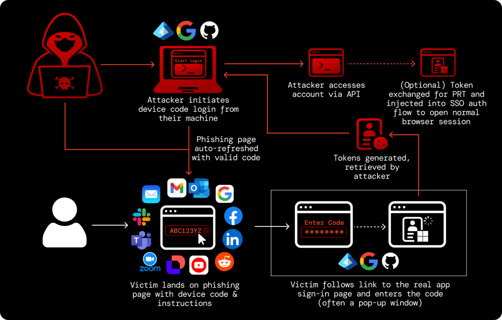

## Threat Intel Findings Online

This attack technique has been very popular in 2026. Campaigns have grown from 15x to 37.5x since early in the year, with 50,000+ observed since March. The surge is driven by Phishing-as-a-Service kits (EvilTokens, Tycoon 2FA, Cali365) that let low-skill attackers run AI-assisted campaigns at scale, targeting small to enterprise clients.

## How it works

Victims are lured via email, QR codes, or even compromised Microsoft Teams invites that spoof DocuSign, Microsoft, or Mimecast enrollment prompts. The lure walks them into entering a device code on a *legitimate* vendor authentication page and approving the consent request. Once approved, the attacker receives a valid access token, without ever needing to enter a password or complete MFA themselves.

## Flow Chain Example

*Figure 1: Device code phishing flow, from attacker-initiated login to token capture.*

## Why it's dangerous

| Bypasses MFA / passkeys                                                                     | Evades detection                                                                            | Durable access                                                                                |
| ------------------------------------------------------------------------------------------- | ------------------------------------------------------------------------------------------- | --------------------------------------------------------------------------------------------- |
| Auth happens on the real provider's domain, so all authentication checks pass legitimately. | No malicious link or fake login form to flag. The infrastructure is genuinely the vendor's. | Long-lived tokens and rogue device registrations, rather than a one-time password compromise. |

The most commonly phished service is Microsoft 365 / Entra ID, both directly and indirectly via lures that impersonate other brands (like Mimecast) to redirect victims into the real Microsoft login. Separately, the same device-code technique has also been used to attack other platforms' own OAuth flows directly, including Salesforce and GitHub.

## The Pivot

OAuth device-code flow (built for keyboard-less devices like smart TVs) isn't Microsoft-specific. It's transferable, so any platform that supports it can be exploited the same way. What began with Storm-2372's Microsoft 365 campaigns in 2024, then expanded via the EvilTokens PhaaS kit in 2026, has now been transferred to other platforms:

| Platform       | Role   | Details                                                                                                                                                                                                                                                                                                                                                                   |
| -------------- | ------ | ------------------------------------------------------------------------------------------------------------------------------------------------------------------------------------------------------------------------------------------------------------------------------------------------------------------------------------------------------------------------- |
| **Salesforce** | Target | Worst non-Microsoft case so far. Scattered Lapsus$ Hunters (Scattered Spider + ShinyHunters + LAPSUS$) combined vishing with device-code phishing on Salesforce's /setup/connect page, tricking victims into authorising a fake Data Loader app. Claimed 1,000+ orgs, around 1.5B records exposed. Salesforce's fix was to remove OAuth device flow entirely (Sept 2025). |
| **GitHub**     | Target | Very effective to imitate. An authorised red-team in 2025 ran an ethical "GitHub Device Code Phishing" campaign against developers with a 90% success rate. Stolen tokens exposed private repos, Actions secrets and CI/CD pipelines, which is a real supply-chain risk.                                                                                                  |
| **Mimecast**   | Lure   | Not the target but the lure. Fake "device enrolment" pages impersonate Mimecast to push victims through the real Microsoft login, which harvests M365 tokens.                                                                                                                                                                                                             |

## Common Indicators

> **Note:** The hostnames below rotate often, so use them as patterns to hunt for rather than a fixed blocklist. The parent platforms are legitimate services and blocking them outright will likely break normal traffic. Newly seen subdomains are the ones to look at.

### Known abused hosting and redirect domains

| Domain / pattern         | What it's used for                                                                                                                                                                                                                                                                                     |
| ------------------------ | ------------------------------------------------------------------------------------------------------------------------------------------------------------------------------------------------------------------------------------------------------------------------------------------------------ |
| `*.workers[.]dev`        | Cloudflare Workers. Most common host for the final device code landing page. EvilTokens pages often follow the pattern `<lure>-xxx.<name>-s-account.workers[.]dev` where the prefix matches the lure theme (adobe-, docusign-, onedrive-, sharepoint-, voicemail-, fax-, quarantine-, page-password-). |
| `*.vercel[.]app`         | Hosts redirect logic so the traffic blends in with normal cloud traffic.                                                                                                                                                                                                                               |
| AWS Lambda URLs          | Also used to host redirect logic.                                                                                                                                                                                                                                                                      |
| Compromised legit sites  | Often WordPress. Used as redirectors or staging pages, sometimes chained across several hops.                                                                                                                                                                                                          |
| Fake CAPTCHA / Turnstile | Placed in front of the landing page to stop URL scanners and sandboxes from seeing the lure.                                                                                                                                                                                                           |

### Email and lure indicators

- Sent from genuine but compromised third-party (supplier/partner) mailboxes, so sender reputation checks pass.
- Document-share or notification themes: DocuSign, Adobe Acrobat, OneDrive/SharePoint shared files, voicemail, fax, quarantined email, password expiry, or Mimecast "device enrolment".
- Links delivered through QR codes, SVG/HTML attachments or Teams invites instead of a plain URL in the body.
- A page showing a short code and asking the user to "verify your identity" by entering it at microsoft.com/devicelogin (or another vendor's device login page).

### Network and web indicators

- Address bar shows a workers[.]dev (or similar serverless) domain while the page claims to be DocuSign, Adobe, Microsoft, etc.
- EvilTokens pages get the code via a POST to `/api/device/start`, then poll `/api/device/status/<sessionId>` until the victim signs in. Both paths can be searched for in proxy logs.
- A visit to a newly seen serverless subdomain followed straight away by microsoft.com/devicelogin or login.microsoftonline.com.

### Identity and sign-in log indicators (Entra ID / M365)

- Sign-ins with **Authentication Protocol / Device Code**, especially for users who don't normally use device code flow.
- Device code sign-ins to **Microsoft Authentication Broker** or other first-party apps the user wouldn't normally sign in to this way.
- A **new device registration / Entra device join** shortly after a device code sign-in (persistence via PRT).
- Token use from an unfamiliar IP, ASN or location shortly after the device code sign-in.
- Spike in **Microsoft Graph API** activity afterwards, e.g. mailbox searches or new inbox rules (often leads into BEC).

### User-side red flags

- Being asked to enter a code on a login page when they didn't start signing in on a TV, printer or other device.
- Being told a code is needed to "view a document", "complete enrolment", etc, anything that seems unusual/suspicious that contains a link and requires input.

## References

1. [Mimecast: OAuth Device Code Phishing Campaigns Surge with EvilTokens Toolkit](https://www.mimecast.com/threat-intelligence-hub/oauth-device-code-phishing-campaigns/)
2. [Microsoft Threat Intelligence: Storm-2372 conducts device code phishing campaign](https://www.microsoft.com/en-us/security/blog/2025/02/13/storm-2372-conducts-device-code-phishing-campaign/)
3. [Microsoft Security: Unmasking EvilTokens](https://www.microsoft.com/en-us/security/blog/2026/09/22/unmasking-eviltokens-getting-to-the-root-of-device-code-phishing/)
4. [The Hacker News: ShinyHunters OAuth token abuse pattern](https://thehackernews.com/2026/07/microsoft-maps-year-long-shinyhunters.html)
5. [Praetorian: Introducing GitHub Device Code Phishing](https://www.praetorian.com/blog/introducing-github-device-code-phishing/)
6. [AppOmni: Scattered Lapsus$ Hunters and the Salesforce supply chain attack](https://appomni.com/blog/device-code-phishing-saas/)
7. [Sekoia: New widespread EvilTokens kit, device code phishing as-a-service](https://blog.sekoia.io/new-widespread-eviltokens-kit-device-code-phishing-as-a-service-part-1/)
8. [LevelBlue SpiderLabs: The Device Code Phishing Tsunami](https://www.levelblue.com/blogs/spiderlabs-blog/the-device-code-phishing-tsunami-what-were-seeing-in-the-wild)
9. [ZeroBEC: EvilTokens Returns, Device-Code Phishing Through Legacy Email Aliases](https://zerobec.com/blog/eviltokens-device-code-phishing-legacy-aliases)
